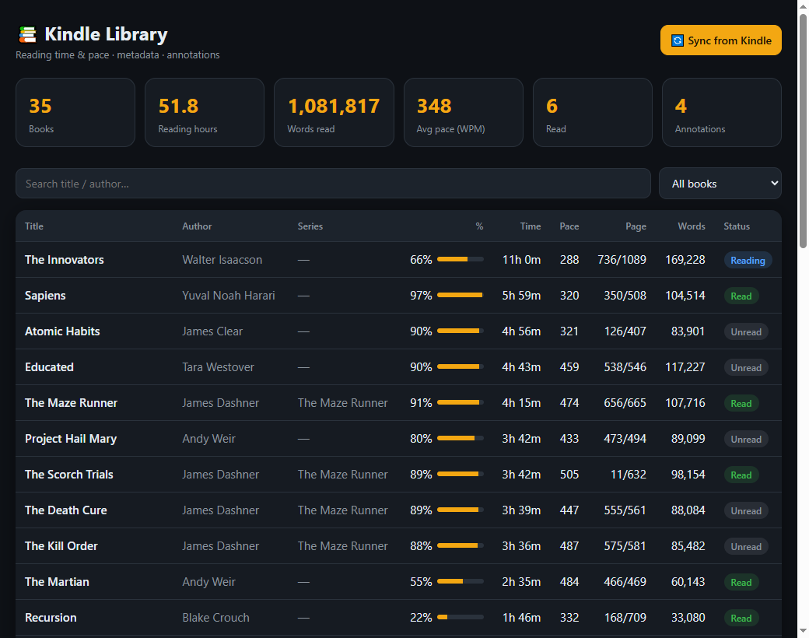

# kindle-reading-dashboard

A local, offline toolkit to **read, decode, and visualize the reading metadata a Kindle stores on-device** — reading time, pace (WPM), per-book progress, highlights, page mapping, and read/unread status — with a clean local web dashboard.

No cloud account, no Amazon API, no KOReader. Everything is parsed straight from the device's own files over SSH (USB networking) or from a USB mass-storage mount.

> Tested on a **Kindle Basic 10th gen (J9G29R), firmware 5.18.1**, jailbroken with USB networking enabled.

> Discussion / support: [MobileRead thread #373997](https://www.mobileread.com/forums/showthread.php?t=373997).



---

## What it does

- **Library list** — every book with title, author, series, % complete, reading time, pace (WPM), current page, and read/reading/unread status. Sortable, searchable, filterable.
- **Per-book detail** — full metadata: reading-time model, reading-speed distribution, reading timeline, device sessions, highlights/notes, font/display prefs, all `cc.db` fields, and the raw decoded JSON of every source.
- **Position → page translation** — converts Kindle internal positions to printed page numbers via the `apnx` page map.
- **Read/unread status** — surfaces the modern "Mark as Read" status, which the new Kindle app stores **outside** the legacy library DB (see [docs/read-state-storage.md](docs/read-state-storage.md)).

---

## Where the data comes from

The Kindle keeps several independent on-device stores. This toolkit reads all of them and joins them per book:

| Data | Source file (on device) | Format | Notes |
|------|--------------------------|--------|-------|
| Title, author, series, % progress, legacy read-state | `/var/local/cc.db` | SQLite | The "Content Catalog" library DB. See [docs/cc-db-schema.md](docs/cc-db-schema.md). |
| **Reading time + pace (WPM)** | `<book>.sdr/*.azw3f` → `timer.model` | KRDS (binary) | The native reader records reading time locally. See [docs/KRDS-format.md](docs/KRDS-format.md). |
| Total words in book | `*.azw3f` → `book.info.store` | KRDS | |
| Page-turn history / timeline | `*.azw3f` → `page.history.store` | KRDS | Sparse on FW 5.18.x (often one record/book). |
| First/last read position | `*.azw3f`/`*.azw3r` → `lpr`/`fpr` | KRDS | |
| Highlights / notes / bookmarks | `<book>.sdr/*.azw3r` → `annotation.cache.object` | KRDS | |
| Font / margins / display prefs | `*.azw3r` → `font.prefs` | KRDS | |
| Printed page mapping | `*.azw3r` → `apnx.key.oPNToPosition` | KRDS | Index = printed page → starting position. |
| **Modern "Mark as Read"** + device reading sessions | `/mnt/us/system/fmcache/fmcache.db` | SQLite (fast-metrics) | The new app keeps read-state here + the cloud, NOT in `cc.db`. See [docs/read-state-storage.md](docs/read-state-storage.md). |

The `.sdr` "sidecar" folders live next to each book under `/mnt/us/documents/<author>/<title>.sdr/`.

---

## Install

Requirements:
- **Python 3** (standard library only, except `paramiko` for SSH).
- `pip install paramiko`

```bash
git clone <this-repo>
cd kindle-reading-dashboard
pip install paramiko
```

### Do you need a jailbroken Kindle?

The **full dashboard** needs a jailbroken device (SSH/root). Basic sidecar decoding works on a **stock** device mounted as a USB drive:

| Capability | Jailbreak needed? | Why |
|------------|:---:|-----|
| Reading time/pace, highlights, page mapping (from `.azw3f`/`.azw3r` sidecars) | **No** | The `.sdr` folders live in `documents/`, readable on a plain USB mount. Use the CLI scripts or `--local D:/documents`. |
| Full library (title/author/series/%) from `cc.db` | **Yes** | `cc.db` is in `/var/local` — not exposed over USB; needs root/SSH. |
| "Mark as Read" status (`fmcache.db`) | **Yes** | Under `/mnt/us/system` — needs system access. |
| Full dashboard with SSH sync | **Yes** | SSH only exists on a jailbroken device. |

### Connecting to the Kindle

Two ways — both supported:

1. **SSH over USB networking (usbnet)** — default. A jailbroken Kindle with usbnet exposes an SSH server (busybox `dropbear`/`sshd`, **no SFTP**). Connection details come from environment variables (defaults match the standard usbnet setup):

   ```bash
   export KINDLE_HOST=192.168.15.244   # usbnet device IP (default)
   export KINDLE_USER=root             # default
   export KINDLE_PW=kindle             # the well-known default jailbreak password
   ```

   **Public-key login.** If your device is configured for key-only SSH (public
   key in `authorized_keys`, password auth disabled), point at a private key and
   clear the password:

   ```bash
   export KINDLE_SSH_KEY=~/.ssh/id_ed25519   # private-key path
   export KINDLE_PW=                         # empty = don't try password
   ```

   `ssh-agent` and default `~/.ssh` keys are also picked up automatically
   (`look_for_keys`/`allow_agent` are on). Password stays the default, so
   existing setups are unaffected. (Reported on MobileRead:
   [thread #373997](https://www.mobileread.com/forums/showthread.php?t=373997).)

   If Windows shows the Kindle as *"Unknown USB Device (Device Descriptor Request Failed)"* or as a COM port instead of a network adapter, see [docs/usb-networking.md](docs/usb-networking.md).

2. **USB mass storage / local folder** — mount the Kindle as a drive and point the tool at the `documents` folder. (`cc.db` is **not** on the USB partition, so pull it once via SSH; sidecars are on the USB partition.)

---

## Usage

```bash
# SSH sync (cc.db + fmcache.db + all sidecars) -> build -> open browser
python reader-dashboard/dashboard.py serve

# Reuse the existing local cache (no device needed)
python reader-dashboard/dashboard.py serve --no-sync

# Read sidecars from a locally-mounted Kindle instead of SSH
python reader-dashboard/dashboard.py serve --local D:/documents

# Just sync, or just rebuild library.json
python reader-dashboard/dashboard.py sync
python reader-dashboard/dashboard.py build
```

Opens at `http://127.0.0.1:8742/`. The **🔄 Sync** button re-pulls from the device and rebuilds.

### Command-line scripts (no dashboard)

The `reading-metadata/scripts/` folder has standalone CLI tools:

```bash
python reading-metadata/scripts/krds.py <file.azw3f|.azw3r>   # decode one sidecar to JSON
python reading-metadata/scripts/reading_stats.py D:/documents # per-book time + pace table + CSV
python reading-metadata/scripts/page_history.py D:/documents  # reading sessions / timeline
python reading-metadata/scripts/export_annotations.py D:/documents  # highlights/notes -> CSV
python reading-metadata/scripts/dump_sidecars.py D:/documents # decode every sidecar to JSON
```

---

## How it works

1. **sync** — pulls `cc.db`, `fmcache.db`, and every `.azw3f`/`.azw3r` under `documents` into `reader-dashboard/cache/`, preserving the folder tree. Over SSH it streams each file with `cat` (busybox has no SFTP) on a single connection, with proper shell-quoting for paths containing spaces and apostrophes.
2. **build** — joins each `cc.db` `Entry:Item` to its `.sdr` sidecar via `p_location`, decodes the KRDS sidecars with the patched `krds.py`, merges the `fmcache.db` read-state + sessions, computes derived stats, and writes `reader-dashboard/web/library.json`.
3. **serve** — a stdlib `http.server` serves `web/` (with `no-store` headers) plus a `POST /api/refresh` endpoint.

---

## Repository layout

```
kindle-reading-dashboard/
├─ ksh.py                       # tiny SSH run/get/put helper (paramiko, env-configured)
├─ reader-dashboard/
│  ├─ dashboard.py              # sync + build + serve (single entrypoint)
│  └─ web/                      # index.html, book.html, common.js, style.css
├─ reading-metadata/
│  └─ scripts/                  # krds.py (patched) + standalone CLI tools
└─ docs/
   ├─ KRDS-format.md            # the .azw3f/.azw3r binary format, every structure
   ├─ cc-db-schema.md           # the cc.db library database schema
   ├─ read-state-storage.md     # where "Mark as Read" actually lives
   └─ usb-networking.md         # Kindle usbnet + Windows RNDIS troubleshooting
```

Personal reading data (`cache/`, `library.json`, CSVs, decoded sidecars) is **git-ignored** and never committed.

---

## Credits

- **`reading-metadata/scripts/krds.py`** — Kindle Reader Data Store parser by **John Howell** (`jhowell@acm.org`), © 2019, **GPL v3**. Background and format history:
  - https://www.mobileread.com/forums/showthread.php?t=322172
  - https://github.com/K-R-D-S/KRDS
  - This repo's copy is **patched for FW 5.18.x** (a `raw` fallback in `decode_object` and draining of unknown trailing fields) so newer firmware structures don't break decoding.
- **`cc.db` schema** documentation cross-referenced with the [kindlewiki cc.db notes](https://sighery.github.io/kindlewiki/kindle-hacking/cc.html) and the [kindle-series-manager](https://github.com/sighery/kindle-series-manager) project.
- **Windows RNDIS driver** for Kindle USB networking by **Marco77** (MobileRead): https://www.mobileread.com/forums/showthread.php?p=3283986
- Everything else (dashboard, fmcache read-state discovery, page mapping, FW-5.18 patches) written for this project.

## License

**GPL v3** — required because it incorporates the GPLv3-licensed `krds.py`. See [LICENSE](LICENSE).

## Disclaimer

- **Not affiliated with Amazon.** "Kindle" and "Amazon" are trademarks of Amazon.com, Inc. This is an independent, unofficial project; the names are used only descriptively to indicate compatibility (nominative fair use).
- **For personal use** with your own device and your own books/documents. It reads metadata files the device already wrote; it performs **no writes** to the device (read-only sync).
- **No DRM circumvention.** This tool reads reading-metadata and library files only. It does **not** decrypt books, strip DRM, or access protected content.
- **Jailbreak.** The full dashboard assumes a device with USB networking/root, which you enable yourself. Jailbreaking may violate Amazon's Terms of Service; that is between you and Amazon. This software does not jailbreak anything — it only reads files once access exists.
- Provided **as-is, without warranty**, under the GPL v3. Use at your own risk.
